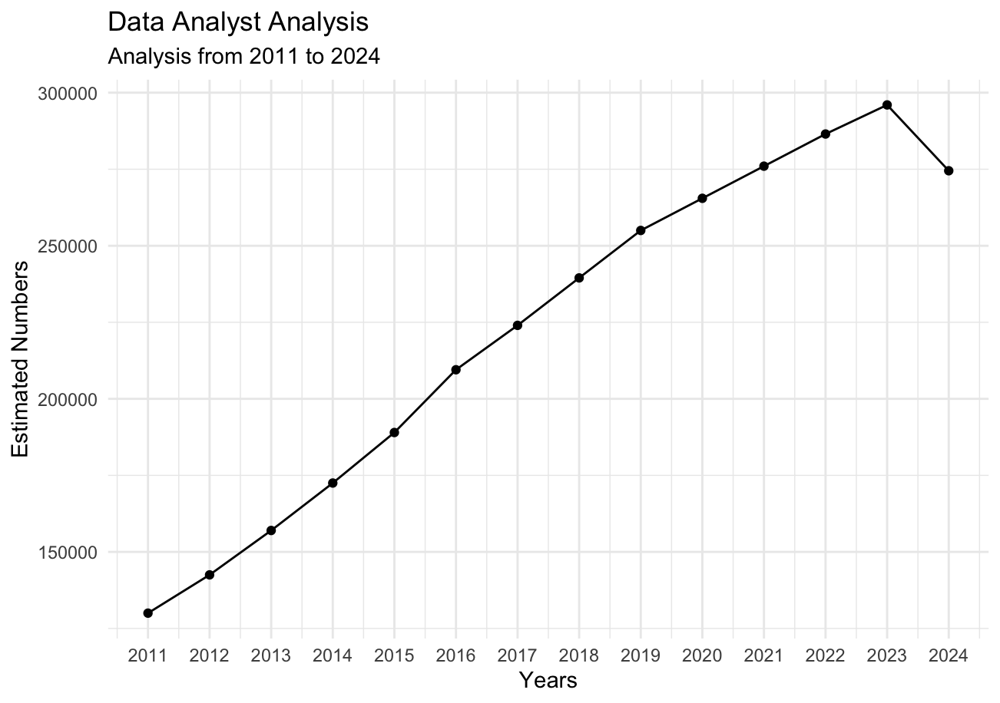
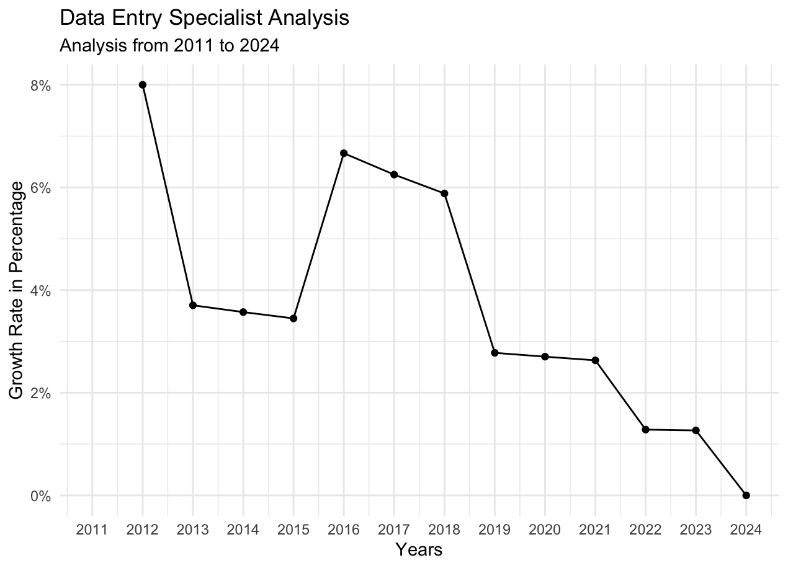
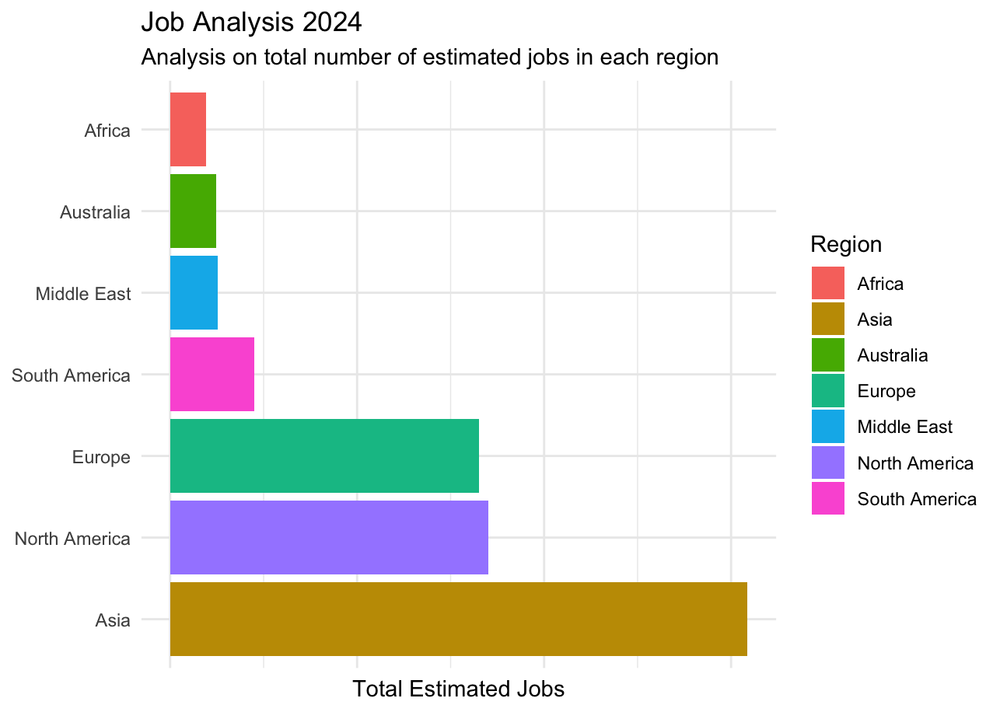
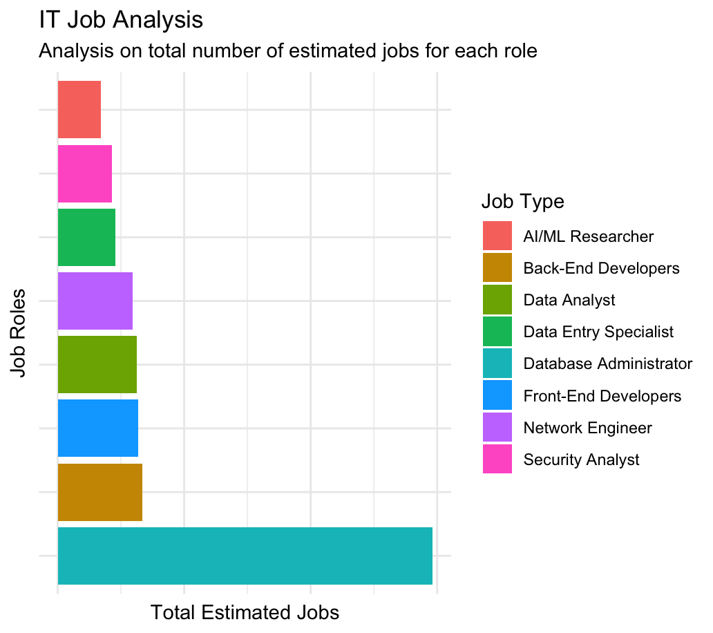
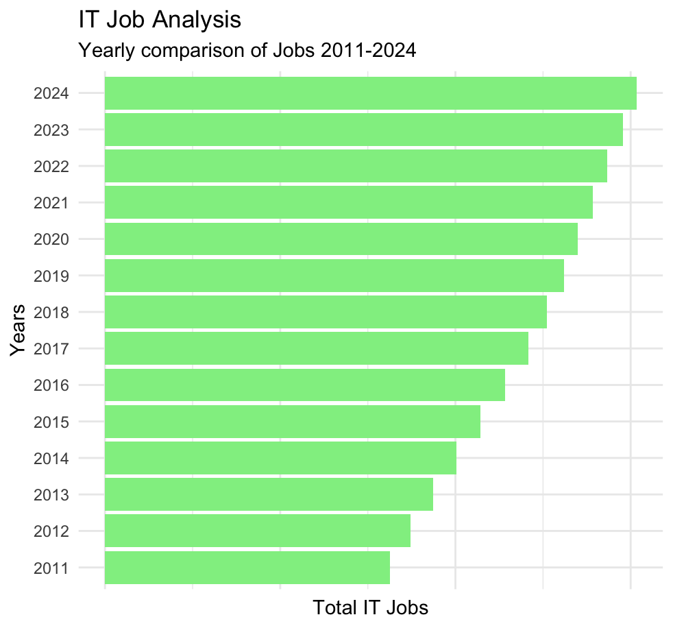

# IT JOB ANALYSIS 2011 - 2024

A project with estimated numbers to analyse IT job from 2011 to 2024.

Following job roles are included in my project:

-    Data Analyst

-    Front - End Developer

-    Back - End Developer

-    Data Entry Specialist

-    Network Engineer

-    Security Analyst

-    Database Administrator

-    AI/ML Researcher

    **Note:** The estimated numbers in the data set may not be perfect numbers because I created this data set with the help of *Chatgpt* so there might be mistakes in numbers but this is a good project to consider as a beginner level project.

## Trend Analysis

In trend analysis, you need to research about two things:

-   Each Job Role Analysis

-   Region Wise Analysis

### Each Job Role Analysis

In each job role analysis, you need to analyze the changes in specific job according to years.

``` r
# creating new dataframe to get data for each job role according to years
job_df <- df %>%
  group_by(Year, `Job Type`) %>%
  summarise(Total=sum(`Estimated Number`))
job_df

# Filtering job types to include data only for the data analyst
job_data_analyst <- job_df %>%
  filter(`Job Type` == "Data Analyst")
job_data_analyst
```

Now we have data for "Data Analyst", let's create our scatter plot with more clear representation of our result.

``` r
ggplot(data=job_data_analyst, aes(x=Year, y=Total)) +
  geom_line() + geom_point() + 
  # adding breaks from 2011 to 2024 to include each year on x axis
  scale_x_continuous(breaks = seq(2011, 2024, by=1)) +
  # setting theme of own choice
  theme_minimal() + 
  labs(title = "Data Analyst Analysis", subtitle = "Analysis from 2011 to 2024" ,x = "Years" ,y= "Estimated Numbers")
```



### Region-wise Analysis

Now analyze specific job role in each year region wise according to their growth rates that how patterns change or in which region their is an increase or decrease.

``` r

growth_rate_data <- df %>%
  group_by(Region, `Job Type`) %>%
  # used dplyr lag function to shift a time series or vector by a specified number, often
  # to create lagged variables for time analysis or data manipulation
  mutate(`Growth Rate`=(`Estimated Number`-lag(`Estimated Number`))/lag(`Estimated Number`))
growth_rate_data  
```

Now, we have created our new column of Growth Rate, now let's create a new data frame object in which we filter by region and job Type.

``` r
region_wise_DES <- growth_rate_data %>%
  filter(Region == "Europe", `Job Type`== "Data Entry Specialist")
```

Let's create a scatter plot for better representation.

``` r
ggplot(data=region_wise_DES, aes(x=Year, y=`Growth Rate`)) +
  geom_line() +
  geom_point() +
  scale_x_continuous(breaks=seq(2011,2024, by=1)) +
  # changing the y axis labels to percent using scales function
  scale_y_continuous(labels=scales::percent) +
  theme_minimal()
```



## Regional Distribution

Now, we need to regional analysis visualizing which region has the highest number of jobs.

Let's go for the latest year in our data set for analysis.

``` r
regional <- growth_rate_data %>%
  filter(Year == max(Year)) %>%
  group_by(Region) %>%
  summarise(Total = sum(`Estimated Number`))
```

Now we got the total number of jobs region wise in 2024.

Let's create a bar chart for more clear representation.

``` r
ggplot(data=regional, aes(x=reorder(Region, -Total), y=Total)) +
  geom_bar(stat="identity", aes(fill=Region)) +
  theme_minimal() +
  coord_flip() +
  theme(axis.text.x=element_blank()) +
  theme(axis.title.y = element_blank()) +
  labs(title="Job Analysis 2024", subtitle="Analysis on total number of estimated jobs in each region", x= "Regions", y="Total Estimated Jobs")
```



## Role Popularity

Now we will calculate which job has the greatest popularity from 2011 to 2024.

``` r
role_popularity <- df %>%
  group_by(`Job Type`) %>%
  summarise(Total = sum(`Estimated Number`))
```

Now we will create a bar chart for clear representation for our result.

``` r
ggplot(data=role_popularity, aes(x=reorder(`Job Type`, -Total), y=Total)) +
  geom_bar(stat="identity", aes(fill=`Job Type`)) +
  theme_minimal() +
  coord_flip() +
  theme(axis.text.x = element_blank()) +
  theme(axis.text.y = element_blank()) +
  labs(title="IT Job Analysis", subtitle = "Analysis on total number of estimated jobs for each role", x= "Job Roles", y="Total Estimated Jobs" )
```



## Yearly Comparison

Now we will do a yearly comparison that which year there are most IT jobs.

``` r
yearly_comparison <- growth_rate_data %>%
  group_by(Year) %>%
  summarise(Total = sum(`Estimated Number`))
```

Now let's create a bar chart for more clear representation.

``` r
ggplot(data=yearly_comparison, aes(x=reorder(Year,Total), y=Total)) +
  geom_bar(stat="identity", fill="lightgreen") +
  theme_minimal() +
  coord_flip() +
  theme(axis.text.x = element_blank()) +
  labs(title="IT Job Analysis", subtitle = "Yearly comparison of Jobs 2011-2024", x="Years", y="Total IT Jobs")
```


